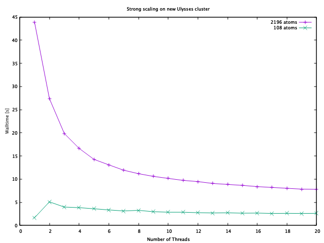

# Report of performace: Baseline

This file includes the profiling results of the project. 

**Argon 108**

|    Function        | OpenMP Mutex   | Opt-{1,2,3} | No Optimised |
|--------------------|----------------|-------------|--------------|
| force()            | 22,16%         | 93,53%      | 72,68%       |
| pbc()              | --,--%         | --,--%      | 20,12%       |
| pbc@plt            | --,--%         | --,--%      | 4,91%        |
| propagate_velocity | 0,62%          | 3,83%%      | 1,23%        |
| locks              | 12,24%         | --,--%      | -,--%        |

* `Opt-1`: Pure math optimisations
* `Opt-2`: Function inlining (`pbc`)
* `Opt-3`: Newton's third law
* OpenMP Mutex: Adds a tlos of overhead for this case. Measured on a machine
equiped with 2 cores.

The other functions are below 1%.

For **Argon 2916**

|    Function        | OpenMP Mutex   | Opt-{1,2,3} | No Optimised |
|--------------------|----------------|-------------|--------------|
| force()            | 22,16%         | --,--%      | 65,24%       |
| pbc()              | --,--%         | --,--%      | 24,42%       |
| pbc@plt            | --,--%         | --,--%      | 9,57%        |
| propagate_velocity | 0,62%          | --,--%      | 0,09%        |
| locks              | 12,24%         | --,--%      | -,--%        |

Force(): 98,02%

## Walltime 

**Argon 108**

| Function | OpenMP Mutex | OpenMP Atomic | Opt-{1}     | Opt-{1,2}   | Opt-{1,2,3} | No Optimised |
| -------- | ------------ | ------------- | ----------- | ----------- | ----------- | ------------ |
| walltime | 2,405880020  | 2,061464580   | 4,995590517 | 4,325905976 | 2,285692580 | 6,407873303  |

Max Speedup: 2.803

**Argon 2916**

| Function | Opt-{1,2,3} | OpenMP Mutex | OpenMP Atomic | No Optimised |
| -------- | ----------- | ------------ | ------------- | ------------ |
| walltime | 88,83126558 | 65,938505762 | 56,148648560  | 296,5620224  |

Speedup: 4.49755

* OpenMP Mutex: Adds a tlos of overhead for this case. Measured on a machine
equiped with 2 cores.

> Time measured in seconds

* In Ulysses, the speedup with 10 threads was about ~6 times.

